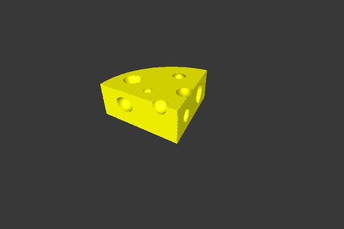
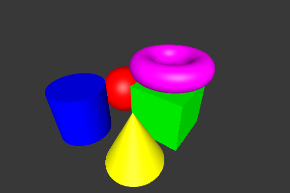
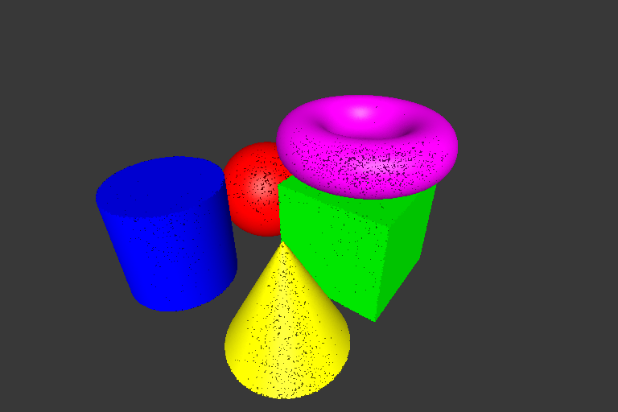
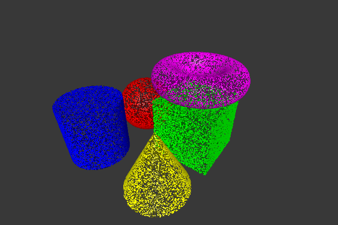
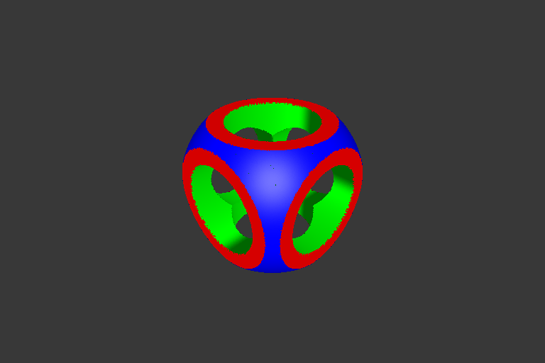

# CSG Tree Point Renderer

3D point rendering system of constructive solid geometry (CSG) scenes based on OpenGL 3/GLUT.

## Presentation

The goal of the project is to realize a point cloud render to a scene obtained by using the [solid construction geometry](https://en.wikipedia.org/wiki/Constructive_solid_geometry) operators technique.
A scene is obtained by composing canonical shapes (spheres, cubes, cylinders, cones and torus) with the CSG operators (union, intersection and difference) represented as a tree.

The implemented strategies allow to obtain the best rendering (a homogeneous distribution of points and an equivalent point density between each form) but at the expense of a longer execution time.
Then, the level of resolution is configurable in order to be able to display scenes on every architectures.

## Point Cloud

A point cloud is point array, where each point have a position, a normal and a color.
The normals are used for the lighting computation.
A point cloud does can do nothing other than to model itself in 3D space.

## Canonical shapes

A canonical shape is a description of the basic geometric object we want to model.
The description includes the color of the shape, the scaling factors and some real arguments if required (like the internal radius for the torus).
Because a canonical shape is just an abstract representation of an object it is necessary to being able to convert it to a point cloud.
The difficulty of canonical shapes lies on their good conversion to their point cloud representations : keep a constancy in the point density between the different shapes and a homogeneous distribution of
points across the surface of each shape.

### Point density

TODO

### Homogeneous distribution

TODO

## CSG Tree

TODO

## Example :

TODO constructive solid geometry [Wikipedia page](https://en.wikipedia.org/wiki/Constructive_solid_geometry).

Other scenes examples are available in directory **scenes/**

## Usage

* Compilation : `make`

* Run : `./csg scene density`
	* *scene* : path to the file scene to display
	* *density* : resolution of the scene to display, can take the value `low`, `medium` and `high`

* Delete binaries : `make mrproper`

