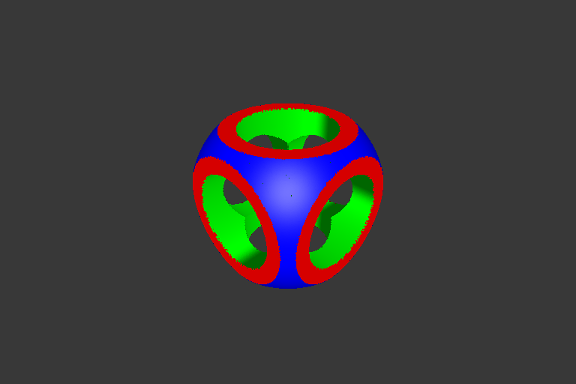

# CSG Tree Point Renderer

3D point rendering system of constructive solid geometry (CSG) scenes based on OpenGL 3/GLUT.

## Presentation

The goal of the project is to realize a point cloud render to a scene obtained by using the [solid construction geometry](https://en.wikipedia.org/wiki/Constructive_solid_geometry) operators technique.
A scene is obtained by composing canonical shapes (spheres, cubes, cylinders, cones and torus) with the CSG operators (union, intersection and difference) represented as a tree.

The implemented strategies allow to obtain the best rendering (a homogeneous distribution of points and an equivalent point density between each form) but at the expense of a longer execution time.
Then, the level of resolution is configurable in order to be able to display scenes on every architectures.

## Point Cloud

A point cloud is point array, where each point have a position, a normal and a color.
The normals are used for the lighting computation.
A point cloud does can do nothing other than to model itself in 3D space.

## Canonical shapes

A canonical shape is a description of the basic geometric object we want to model.
The description includes the color of the shape, the scaling factors and some real arguments if required (like the internal radius for the torus).
Because a canonical shape is just an abstract representation of an object it is necessary to being able to convert it to a point cloud.
The difficulty of canonical shapes lies on their good conversion to their point cloud representations : keep a a homogeneous distribution of points across the surface of each shape and a constancy in the point density between the different shapes.

### Homogeneous distribution

For a smooth rendering, it is necessary to ensure that in figure, each part will be equally covered with points.
To achieved this, we distribute randomly the points over the shape with a particular probability distribution law for each surface of each shape.
The probability distribution law that is choosen when it fit the best as possible a surface.
For example we choose an uniform distribution for a cube face or a gaussian distribution for a sphere.

### Point density

The point density is defined as the number of point per area unit.
So the total number of point required to model a canonical shape is the product of the point density (selected by the user) by the area of the shape.
Hoping the point are evenly distribute over the surfaces, the problem is to compute the area of each canonical shape.

We can use the know formulas to compute the area of the canonical shapes but it work correcty only if no scaling operation is performed on the object.
To tackle this issue, we evaluate the new area of a canonical shape when a homothety is performed.
For some shapes the calculation is still trivial (as in the cube), but in the in most cases the calculation is extremely complicated, for example the sphere which becomes an ellipsoid, and we can not retrieve the exact value of the area.
So we try to use in these cases approximation and just hoping the approximation is good enough to guarantee the consistency of density between canonical shapes.

Here an example when the resolution is at a low level :

When the resolution is at a medium level :

And when the resolution is at a high level :

## CSG Tree

Canonical shapes are used as basic bricks for the construction of scene, then we use CSG operators arranged in the form of a tree to combine the shapes and therefore get more complicated scenes.

A leaf in the CSG tree will be a description of a canonical shape, and an internal node will be a CSG operator.
We have 4 operator: Union without intersection (called Union), Union with intersection (called Identity), Intersection and Difference.
We use the Identity operator when we want to achieve the union of two structures we know the empty is intersection, we then avoid the time necessary to calculate the intersection.
In addition to these CSG operator, we can also perform basic geometric operation like translation, homothety and rotation.

The tree representing the scene is only in a abstract representation so we also need here a way to transform the CSG tree into a point cloud.

To obtain the point cloud of an object obtained by geometry of solid construction, we first implement an algorithm to know if a point belongs to the object.
The algorithm iterate recursively over the node : if the node is a leaf, we check if the point belongs to the canonical shape, otherwise we evaluate the belonging of the point to the subtrees and compose it as a boolean expression in function of the CSG operator of the node.
For example if the node is a union the point must belong to the left subtree or to the right subtree, but if the node is an intersection the point must belong to the left subtree and to the right subtree.

With the belonging algorithm we can then easily obtain the representation in point cloud of the tree with the following algorithm : if the tree is a leaf, then its point cloud corresponds to the point cloud of the canonical object, otherwise we will recursively generate point clouds of left and right subtrees and then merge these two point clouds to generate a new one corresponding to the CSG operator.
The merging strategy is different given the CSG operator and it is based on the belonging function.
For example if the operator is a union, we can get rid of the left subtree points that belong to the right subtree (and vice versa).
If the operator is an intersection, we should only keep only the points of the left subtree points that belong to the right subtree (and vice versa).

Here a result of a CSG tree inspired from [Wikipedia example](https://en.wikipedia.org/wiki/Constructive_solid_geometry#/media/File:Csg_tree.png) :

### Difference composition problem

The recursive implementation can leads to errors in rendering when we want to compose the difference operator (difference of two subtrees when the right subtree is itself a difference). 
The idea would be that if we make a difference between two sub-trees `L` and `R` with `R` also a difference between two subtrees `L'` and `R'`, we want to remove only the points of `L'` and keep those from `L` and `R'` in the final point cloud.
This implies that, when we want to test if a point belongs to a CSG tree with a difference operator at the root, we have to process differently the case where the right subtree is a difference from any other case.

This special case have not been implemented.

## Parser

The project has a scene parser to allow the users to create their own scenes without having to recompile the project.
The user just have to create a scene file (format detailed below) and run the program on his file.
Some scenes examples are already available in directory **scenes/**

### File format

A scene file describe the structure of the CSG tree where each line describe a node (leaf or internal node) and the order of the lines is the result of a depth-first search on the CSG tree.
A line have to follow this format :
- For a leaf : `shape (r, g, b, a) (tx, ty, tz) (rx, ry, rz) (hx, hy, hz)`
	with :
	- `shape` is the canonical form, can take `sphere`, `cube`, `cylinder`, `cone` or `torus radius` (note that `radius` is a real argument for `torus` that correspond to the internal radius)
	- `(r, g, b, a)` is the color of the canonical object
	- `(tx, tx, tz)` is the translation vector
	- `(rx, ry, rz)` is the rotation angles
	- `(hx, hy, hz)` is the scaling factors
- For an internal node : `operator (tx, ty, tz) (rx, ry, rz) (hx, hy, hz)`
	with :
	- `operator` is the geometric operator, can take `+`, `*`, `-` or `=`, corresponding respectively to union, intersection, difference and identity
	- `(tx, tx, tz)` is the translation vector
	- `(rx, ry, rz)` is the rotation angles
	- `(hx, hy, hz)` is the scaling factors

## Usage

* Compilation : `make`

* Run : `./csg scene density`
	* *scene* : path to the file scene to display
	* *density* : resolution of the scene to display, can take the value `low`, `medium` and `high`

Some scenes examples are available in directory **scenes/**

* Delete binaries : `make mrproper`

