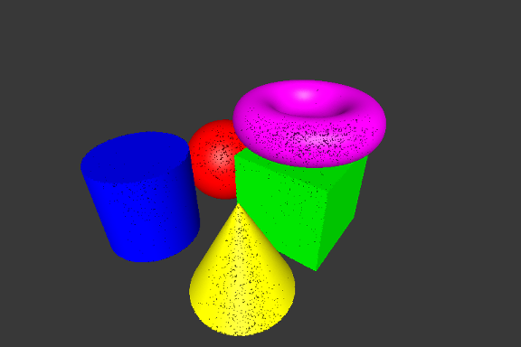

# CSG Tree Point Renderer

- CSG + point rendering
- using OPENGL(version ? 3?)/GLUT

#### Exemple :

TODO constructive solid geometry [Wikipedia page](https://en.wikipedia.org/wiki/Constructive_solid_geometry).

Other scenes examples are available in directory *scenes/*

## Usage

* Compilation : `make`

* Run : `./csg scene density`
	* *scene* : path to the file scene to display
	* *density* : resolution of the scene to display TODO VALUE low, medium, high

* Delete binaries : `make mrproper`

